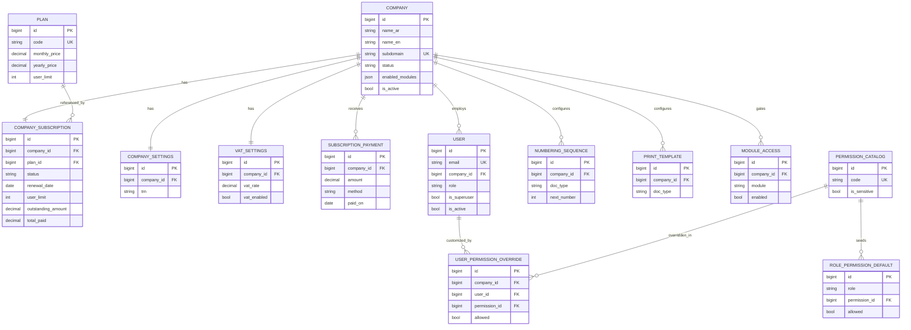
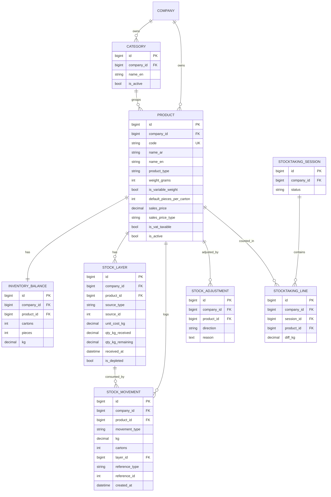
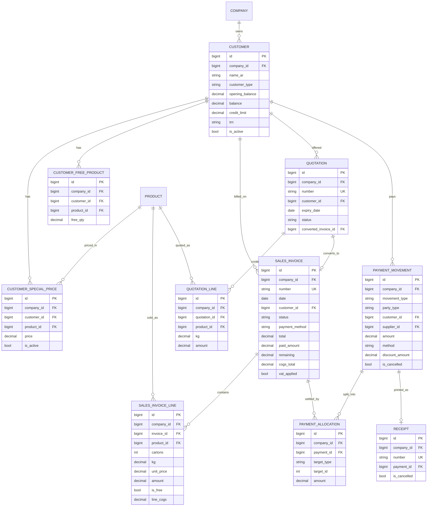
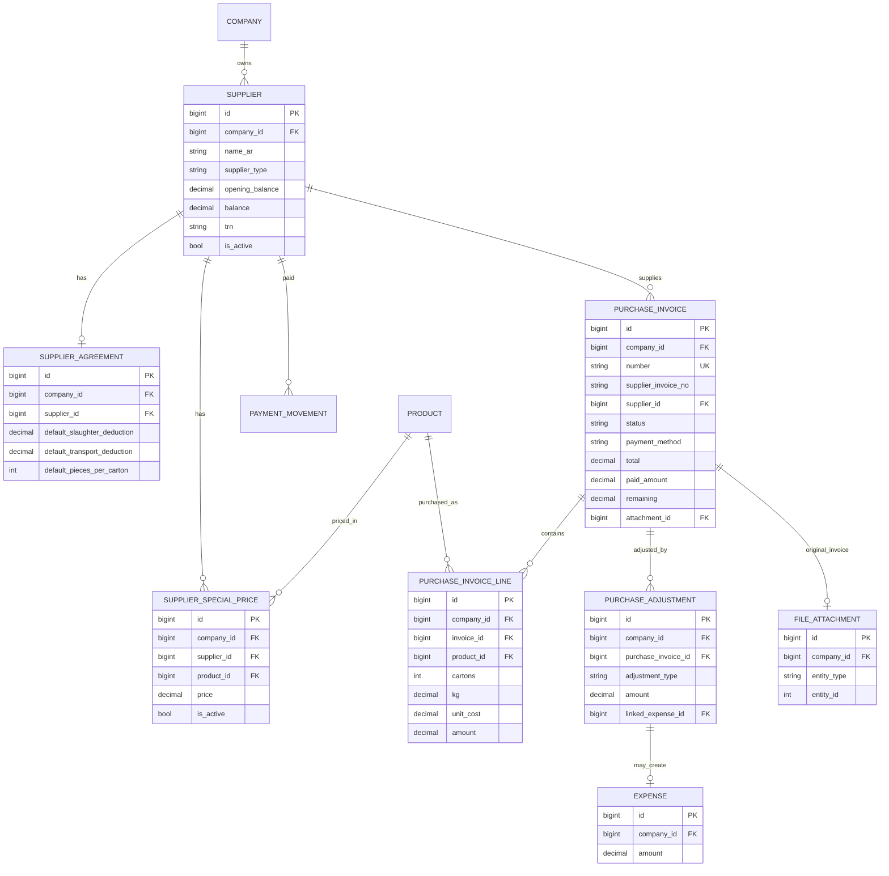
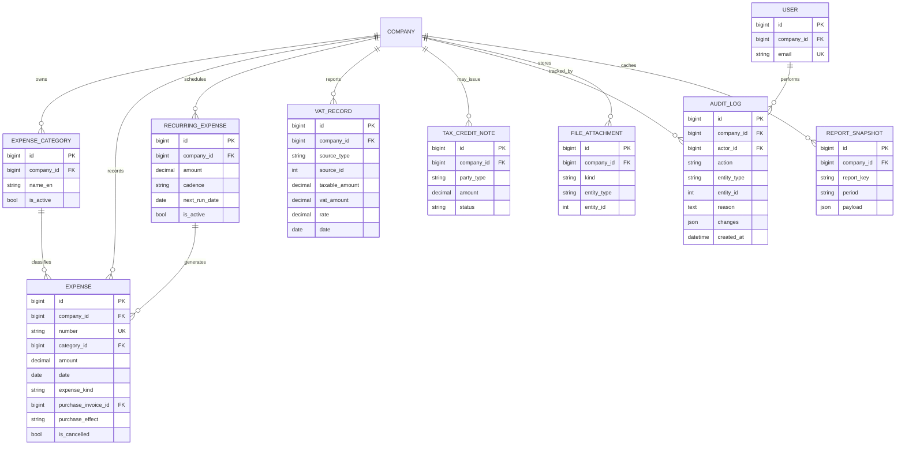

# Poultry Hero — Entity Relationship Diagrams (Mermaid)

> Text-based ERD using Mermaid `erDiagram`. Split into focused diagrams for
> readability; together they describe the full schema in `DATABASE_SCHEMA.md`.
> `COMPANY` is the tenant root — almost every tenant-owned entity has an implicit
> `company_id` FK (shown explicitly only where it aids clarity).

---

## 1. SaaS / tenant / users / permissions layer

---

## 2. Products / inventory / FIFO layer

---

## 3. Customers / sales / quotations / payments

---

## 4. Suppliers / purchases / adjustments / payments

---

## 5. Expenses / tax / audit / documents

---

## Relationship notes

- **Tenant isolation:** all entities except `COMPANY`, `PLAN`, `PERMISSION_CATALOG`,
  `ROLE_PERMISSION_DEFAULT`, and `SUBSCRIPTION_PAYMENT`/`COMPANY_SUBSCRIPTION` (which are
  global but reference one company) carry `company_id`.
- **FIFO:** `PURCHASE_INVOICE` (on approval) creates `STOCK_LAYER` rows; `SALES_INVOICE`
  (on approval) consumes them oldest-first, recording `STOCK_MOVEMENT` rows linked to the
  consumed `layer_id` and setting `line_cogs`.
- **Payments:** `PAYMENT_MOVEMENT` → `PAYMENT_ALLOCATION` targets either a sales invoice,
  a purchase invoice, or `on_account`; `RECEIPT` is the printable artifact.
- **Polymorphic refs:** `STOCK_MOVEMENT.reference_*`, `PAYMENT_ALLOCATION.target_*`,
  `VAT_RECORD.source_*`, `AUDIT_LOG.entity_*`, and `FILE_ATTACHMENT.entity_*` use
  `(type, id)` pairs rather than hard FKs (kept simple for Mermaid).
